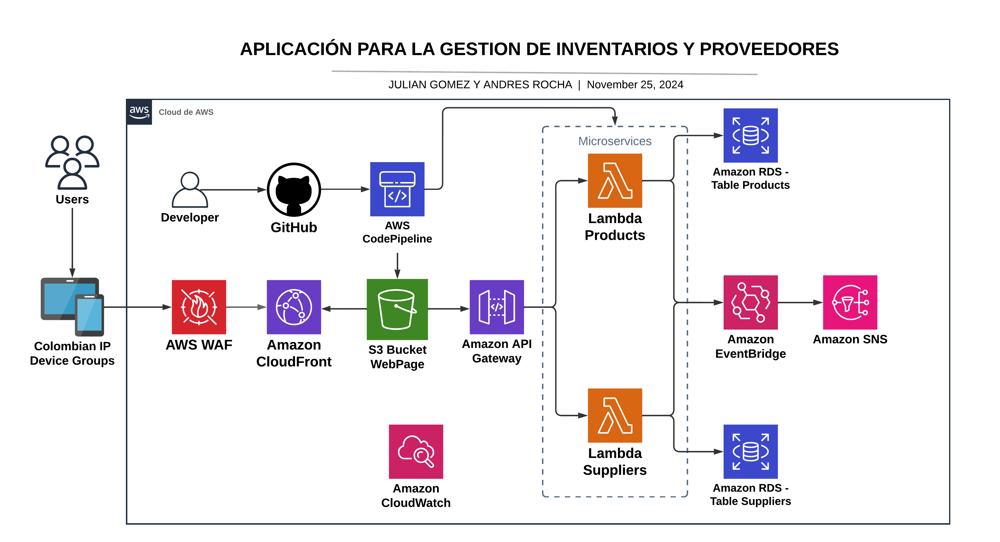

# Gestión de Inventarios y Proveedores - Proyecto AWS

## Objetivo General
Desarrollar una aplicación para la gestión de inventarios y proveedores con funcionalidades CRUD, integrando los principales servicios de AWS aprendidos en el curso. Estos incluyen **Lambdas**, **WAF**, **CloudFront**, **Buckets de S3**, **Amazon API Gateway** y **EventBridge**, utilizando **CDK** para despliegues de infraestructura como código. Además, se explorarán otros servicios como **CodePipeline** para despliegues, **SNS** para notificaciones por correo, **RDS con PostgreSQL** para la base de datos y **CloudWatch** para monitoreo de logs.

---

## Objetivos Específicos

1. **Base de datos**: Diseñar y configurar una base de datos en **RDS** para gestionar datos de inventarios y proveedores.
2. **Lambdas**: Crear al menos dos **Lambdas** por microservicio para manejar métodos CRUD sobre la base de datos.
3. **API Gateway**: Configurar una **API Gateway** que redirija a las Lambdas correspondientes.
4. **Eventos automáticos**: Implementar un flujo de eventos con **EventBridge** para automatizar tareas, como notificaciones mediante **SNS**.
5. **Interfaz web**: Crear una interfaz web estática alojada en un **bucket S3**, distribuida globalmente con **CloudFront**.
6. **Seguridad**: Usar **AWS WAF** para restringir accesos según IP.
7. **Monitoreo**: Configurar **CloudWatch** para registrar métricas y logs relevantes.
8. **Despliegue continuo**: Implementar un pipeline **CI/CD** con **CodePipeline** para automatizar despliegues.

---

## Diseño de Arquitectura

### Flujo y Funcionalidades Esperadas

#### **Gestión de Proveedores**
- Crear, visualizar, actualizar y eliminar proveedores.

#### **Gestión de Productos**
- Crear, visualizar, actualizar y eliminar productos.
- Asociar productos con proveedores para trazabilidad.

#### **Notificaciones**
- Configurar alertas automáticas sobre niveles bajos de inventario.
  - Utilizar **EventBridge** para manejar eventos personalizados (como "stock bajo").
  - Enviar notificaciones por correo electrónico con **SNS**.
- Automatizar el envío de correos de bienvenida al registrar un nuevo proveedor.

#### **Dashboard**
- Crear visualizaciones de estadísticas, logs de movimientos, cantidad de productos y proveedores.

#### **Pipeline de Despliegue**
- Configurar un pipeline para que los cambios en el código se desplieguen automáticamente a los **buckets S3** o **Lambdas**.

#### **Acceso y Seguridad**
- Configurar **WAF** para restringir el acceso solo desde IP colombianas (o de otro país como ejemplo).
- Optimizar el acceso global mediante el uso de **CDN** con **CloudFront**.

---

Este proyecto aprovechará la potencia y flexibilidad de los servicios AWS para construir una solución escalable, segura y eficiente, integrando buenas prácticas de DevOps y arquitectura en la nube.
